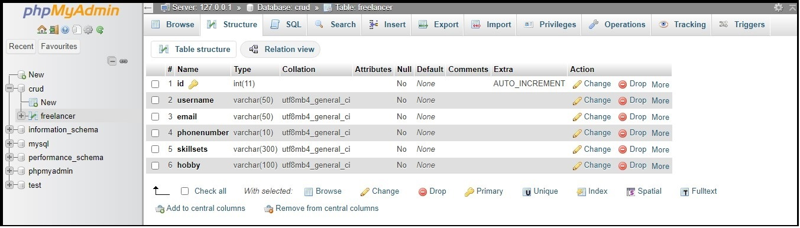

# Example Dev Solution for Assessment

### Technology Stack
- Database: MySQL<br />
- Back End: NodeJS, Express, RESTful API<br />
- Front End: ReactJS (JavaScript)

### Development Directory Structure
Below is the following structure for main js script files.<br />
```
├── frontend
|   └── src
|       ├── App.js
|       ├── Freelancer.js
|       ├── RegisterFreelancer.js
|       └── UpdateUserFreelancer.js
|
|   
├── server
|   └── server.js   
```

1. **frontend**
    - **App.js**: to render main react component with multiple page routes.<br />
    - **Freelancer.js**: a functional component for main page to render the list of users of freelancers.<br />
    - **RegisterFreelancer.js**: a functional component to render a new user registration page.<br />
    - **UpdateUserFreelancer.js**: a functional component to render an update user details page.<br />
2. **server**
    - **server.js**: to describe the implementations of RESTful API using HTTP methods (@GET,@POST @PUT, @DELETE and DB connection.<br />

### Descriptions of Database Creation
1. Used phpMyAdmin to create and access MySQL database.
2. Database was pre-populated with items for testing on server.
3. Created table called **_freelancer_**.

<br />**Screenshot: structure.**<br />

<br />**Screenshot: list of items.**<br />
<br />

### Descriptions of Backend Server Implementation
1. Express framework was used to create and run a server for connection.<br />
2. It also serves to create a DB connection with MySQL.<br />
```javascript
const express = require("express");
const mysql = require("mysql");

// create connection with mysql.
const db =  mysql.createConnection({
    host: "localhost",
    user: "root",
    password: "",
    database: "crud"
});

/* 
    send response from the server.
    @GET to fetch data from mysql database into the server.
*/
app.get('/', (request, response) => {
    const sql = "SELECT * FROM freelancer";
    db.query(sql, (error, data_load) => {
        if (error) {
            return response.json("Error from DB connection!");
        }
        return response.json(data_load);    
    });
});

// app to start and listen on server port 8081 for connection.
app.listen(8081, () => {
    console.log("listening");
});
```
<br />

### Descriptions of Front End Implementation
1. **Freelancer.js** -> implements a functional component to fetch data using React hooks and Axios.
```javascript
import React, { useEffect, useState } from 'react';
import axios from 'axios';

// manage state data.
const [freelancer, setFreelancer] = useState([]);

// fetch data from backend - @GET.
useEffect(() => {
    axios.get('http://localhost:8081/')
        .then(response => {
            console.log(response);
            setFreelancer(response.data);
        })
        .catch(error => console.log(error));
}, []);
```
<br />

**Screenshot: fetch and load data on the main page.**<br />

<br />

2. **RegisterFreelancer.js** -> implements a functional component to register a new user item with the Form using Axios to the backend.
```javascript
import axios from 'axios';
import React, { useState } from 'react';

// initialize state variables.
const [username, setUsername] = useState('');
const [email, setEmail] = useState('');
const [phonenumber, setPhonenumber] = useState('');
const [skillsets, setSkillsets] = useState('');
const [hobby, setHobby] = useState('');

// initialise navigate object.
const navigate = useNavigate();

// event handler to submit data to the backend - @POST.
// redirect to root.
function handleSubmit(event) {
    event.preventDefault();
    axios.post('http://localhost:8081/register', { username, email, phonenumber, skillsets, hobby })
        .then(response => {
            console.log(response);
            navigate('/');
        }).catch(error => console.log(error));
}
```
<br />

**Screenshot: the register new user page.**<br />

<br />

3. **UpdateUserFreelancer.js** -> implements a functional component to update a current user details with the Form.
```javascript
import axios from 'axios';
import React, { useState } from 'react';

// event handler to update data to the backend for update - @PUT.
// redirect to root.
function handleSubmit(event) {
    event.preventDefault();
    axios.put('http://localhost:8081/update/' + id, { username, email, phonenumber, skillsets, hobby })
        .then(response => {
            console.log(response);
            navigate('/');
        }).catch(error => console.log(error));
}
```
<br />

**Screenshot: the update user details page.**<br />

<br />

> [!NOTE]
> [x] Completed frontend and backend implementation as the solution for assessment.
> [x] Managed to required tech stack such as NodeJS, React, Express, MySQL to implement solution and able to meet the requirements for assessment.
> [x] Built necessary functionalities on the UI to perform all operations as stated in the requirements.
> [x] Provided screenshots of images for displaying the outcome of development.

<br />

> [!LIMITATIONS]
> Didn't have the time to implement it with .NET Framework and module, and .NET Restful API.
> Didn't manage to host the working demo at cloud platform as there issues with the configuration and setting of local database. 
> [x] However, I also provided the screenshots of images of development. `#FF0000`

